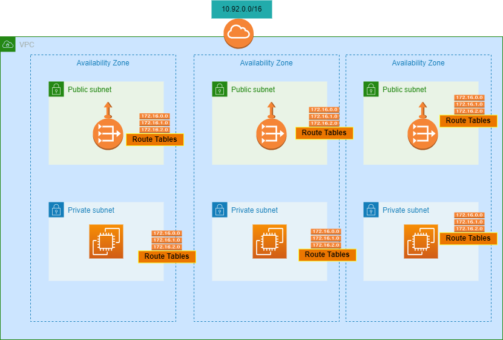

# Terraform Projects on AWS

https://registry.terraform.io/providers/hashicorp/aws/latest

https://developer.hashicorp.com/terraform/language

https://developer.hashicorp.com/terraform/cli

### How to work on this Terraform scripts repo?
1. Go to the directory to manage all env based resources;
```sh
    cd ./01-
    export AWS_PROFILE="terraform"
```

2. Initialize the `backend`, `modules` and `provider plugins`;
```sh
    # terraform init -backend-config="access_key=<your access key>" -backend-config="secret_key=<your secret key>"
    terraform init
```

3. List the all workspaces(using the env based workspace structure);
```sh
    terraform workspace new dev

    terraform workspace list
```

4. Select the `dev` workspace to work on resources;
```sh
    terraform workspace select dev
```

5. Show the current workspace to confirm that working on the correct workspace;
```sh
    terraform workspace show
```

6. Validate the syntax of terraform files;
```sh
    terraform validate
```

7. Generate execution plan to see what changed before to run apply(deploy) the new changes;
```sh
    terraform plan
```

8. Execute/Deploy the actions proposed in terraform plan created at previous step;
```sh
    terraform apply
```
8. Check the private key to connect via ssh to servers;
```sh
    terraform output -raw private_key
```



